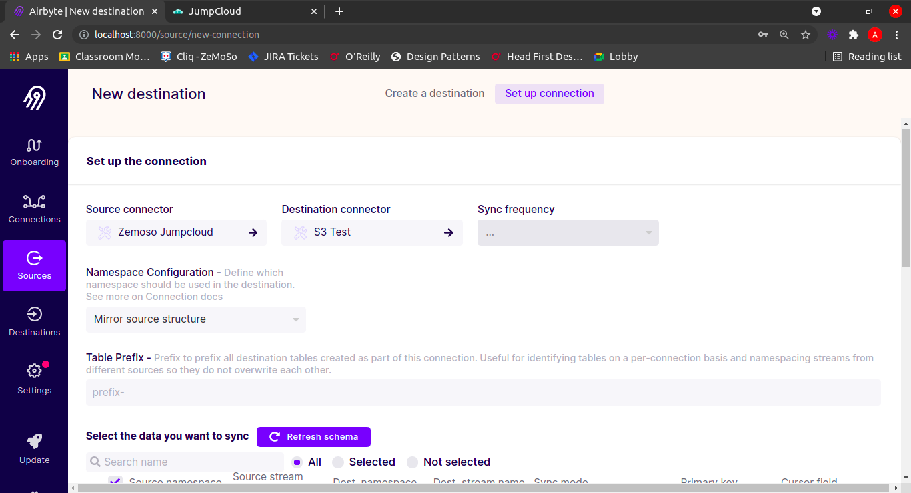
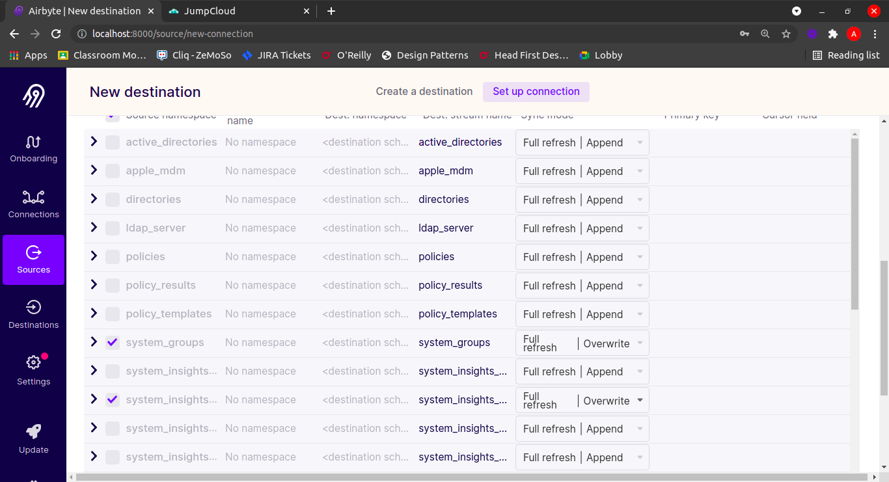

# Tutorial on Jumpcloud - S3 Connection

## Steps:

1. Click on connection in the main page.

2. Click on `+ new connection` button on top right

3. You'll see this page. You are currently in `Choose a Source` tab

4. Select the `Source Type` as Jumpcloud. And give a `Name` of your choice.

5. Enter the `api_key`. You can get one from Jumpcloud Admin Console.
Once you provide an `api_key`, click on `Setup Source`. This will check if the `api_key` is valid or not.

6. You'll be redirected to `Choose a Destination` tab.

7. Search and select for `S3` in `Destination Type` and give a `Name` of your choice.
 

8. Fill the particular fields. Contact admin to get your `S3 Key ID` and `S3 Access Key`. 

9. Select the output format. Eg., CSV Format.

10. Once done, click on `Set up Destination`. 

11. You'll be redirected to `Set up Connection Page`.

12. Select `Sync Frequency`. Eg, Manual - to only fetch data when asked for.

13. Configure which streams you'd like to fetch and their `Sync Modes`.

14. After configuring, click on `Set up Connection` at the end of the page.

15. You'll be redirected to a similar page like this one.

16. Click on `Launch` to start fetching the data and dumping.

17. Once the data is dumped, you'll have a screen similar to this. The task would show `Succeeded` message.

Hope this helps. Contact me if anything I missed anything or find any inconsistencies.